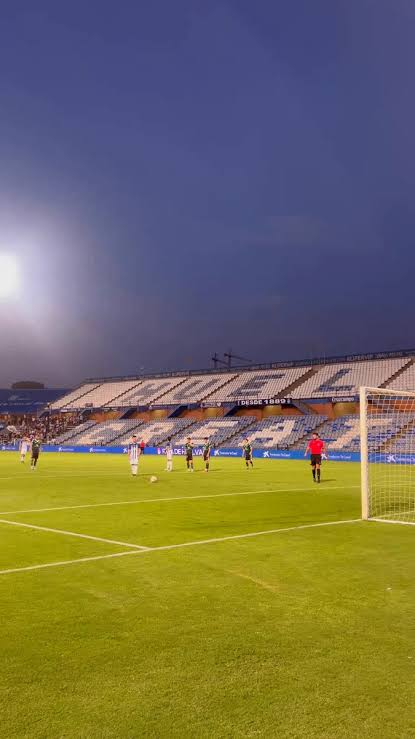
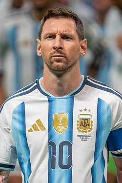

[← Volver al inicio](README.md)
# Temas del curso


```

### 18/09/2026 - Mis aficiones

En mi tiempo libre me gusta jugar a la play, salir con los colegas y pasar tiempo con mi familia,
también juego a futbol en el lada y llevo desde los 4 años jugando y me gusta bastante la verdad,
voy algunos dias al gimnasio para pasar el tiempo y así hacer algo de ejercicio.
```


He estado investigando en internet y he encontrado esta web sobre fútbol https://eddwebster.com/


### 29/09/2026 - Premio princesa de Asturias- Leo Messi

Le dieron el premio princesa de Asturias porque ha destacado en su trayectoria deportiva y por las labores solidarias para que la educación sea mayor y ayudando a niños necesitados, tambien por su humildad, por su respeto y por su ejemplar comportamiento en su afición y y por su constancia  
https://www.fpa.es/es/premios-princesa-de-asturias/premiados/2026-leo-messi/?texto=acta
Leo Messi https://commons.wikimedia.org/wiki/Category:Lionel_Messi



Leo Messi y ganó el Premio Princesa de Asturias 
Lo premian por haber destacado en su carrera futbolística y por la ayuda de los niños necesitados y por las acciones solidarias para la educación 
Lo elegí porque es un futbolista bastante conocido que ha tenido una gran historia en su carrera de jugador de futbol y me gusta bastante por todo lo que ha hecho en todo lo que lleva jugando y apoyando a los niños más necesitados a que tengas un mejor futuro.
